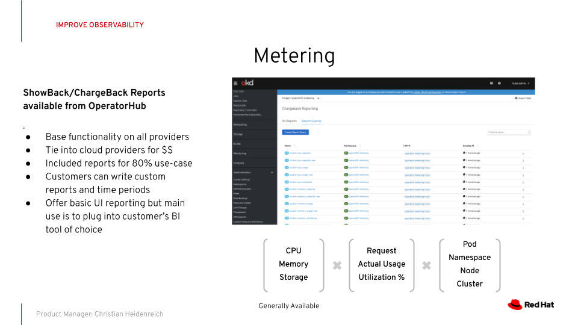
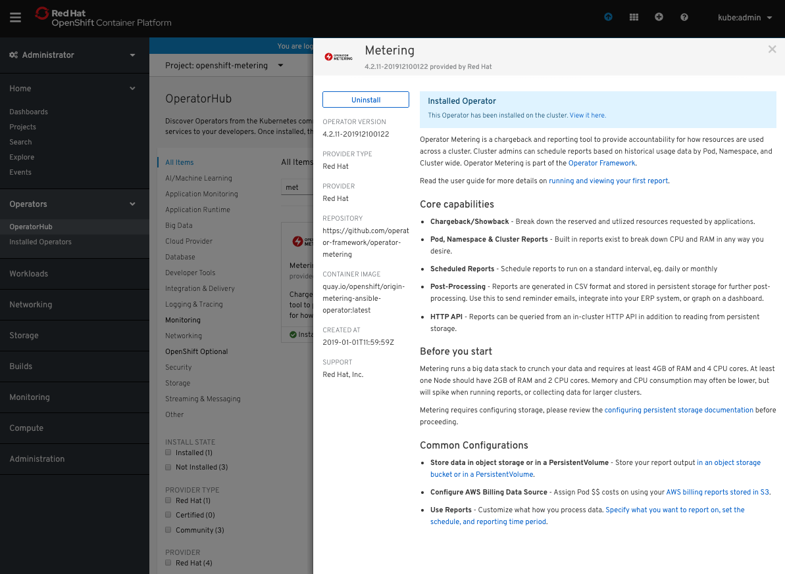

layout: post
title: Red Hat OpenShift 4 內建 Metering 計量計價報表?
author: Phil Huang
tags:
  - openshift
  - metering
categories:
  - openshift
date: 2020-01-03 00:09:00
---

前陣子看 Red Hat OpenShift 4.2 出了一個功能叫做 `Metering`，跟一般知道的 Promethus 的 Metrics 不太一樣，是比較偏向計量計價 (Showback/Chargeback) 的專案。本文將特別針對該功能做個初步研究



<!--more-->

## Q: 這 Metering 專案在幹嘛的?

依據 [About Metering][4]，`Metering` 是 Red Hat OpenShift 官方透過 Operator 支援的一個計量 (showback) 及計價 (chargeback) 的專案

主要是抓取內建於集群內的 Prometheus 作為資料來源，可以計算的單位可從 Pod / Project 作為計算基礎

## Q: 資源預估如何抓?

依據 [About Installing Metering][5]，整理如下：

- CPU: (4 + 2*n) Core
- RAM: (4 + 2*n) G

## Q: 如何處理 `openshift-` 開頭無法被新增的問題

如果按照正常的方式下 `openshift-metering`，應該會遇到下面的問題

```bash
$ oc new-project openshift-metering
Error from server (Forbidden): project.project.openshift.io "openshift-metering" is forbidden: cannot request a project starting with "openshift-"
```

依據 [Bug 1777536][2]，指出 `openshift-*` 是保留字，如果透過 `oc new-project` 等透過 project API 的方式去新增，會被擋下來。

正確做法應該是要繞過 project API 即可，執行
```bash
$ oc create namespace openshift-metering
namespace/openshift-metering created
```

## Q: Project 名可不可亂取？

不行，[Installing the Metering Operator][3] 指出，專案名字一定要叫做 `openshift-metering`，其他專案名不支援

所以請乖乖的下

```bash
$ oc create namespace openshift-metering
namespace/openshift-metering created
```

## Q: 所以 Metering 於 OperatorHub 內叫什麼名字?

名字叫做 `metering-ocp`，可以透過下列指令看更多資訊

```bash
oc get packagemanifests metering-ocp -n openshift-marketplace
oc describe packagemanifests metering-ocp -n openshift-marketplace
```

或者是透過 Web 點選 OperatorHub 後，觀察裡面的東西



## Q: 如何安裝 Metering Operator 於 `openshift-metering` 裡?

請洽 [Installing the Metering Operator][6]


## 


[1]: https://docs.openshift.com/container-platform/4.2/metering/metering-installing-metering.html
[2]: https://bugzilla.redhat.com/show_bug.cgi?id=1777536
[3]: https://docs.openshift.com/container-platform/4.2/metering/metering-installing-metering.html#metering-install-operator_installing-metering
[4]: https://docs.openshift.com/container-platform/4.2/metering/metering-about-metering.html
[5]: https://docs.openshift.com/container-platform/4.2/metering/metering-about-installing-metering.html
[6]: https://docs.openshift.com/container-platform/4.2/metering/metering-installing-metering.html#metering-install-operator_installing-metering