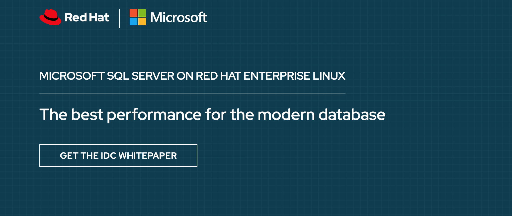
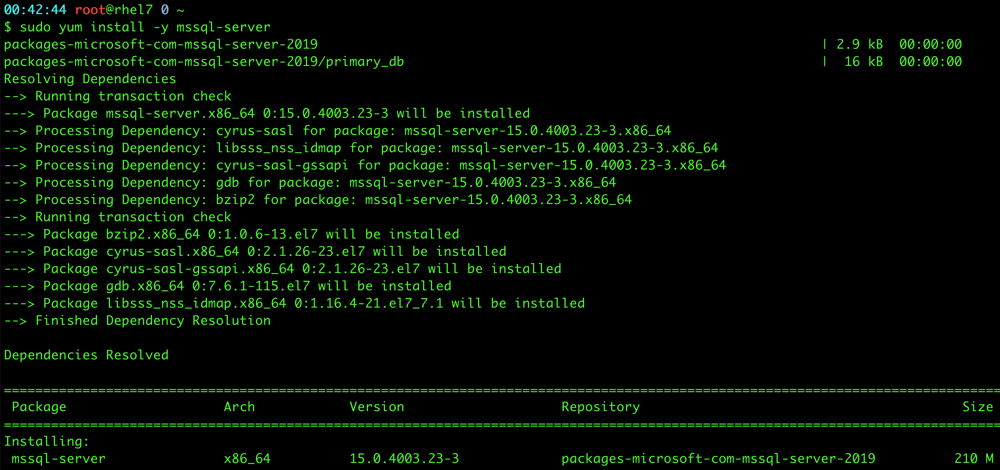

layout: post
title: SQL Server 2019 真的可以跑在 Red Hat OpenShift 上嗎?
author: Phil Huang
date: 2020-01-12 04:01:06
tags:
---
最近因公務需求，受我們公司行銷長官 - Miss 莎 指示去微軟的主場 - [SQL Server 2019 與開源容器Kubernetes實戰營](https://www.microsoftevents.com/profile/form/index.cfm) 講演講，拿到講稿的時候我都暈了，居然是要介紹 MS SQL Server 2019 on RHEL / OpenShift，因為我自己沒什麼點 MS 的技能樹，所以不算熟悉，但幸好 MS 憑藉著超強技術資源力，讓我在被微軟併購的 GitHub 上找到了一個 Workshop 後...就有了下面的文章了

<!--more-->

## 正題開始
### Q: As Title. 真的假的?

這是真的，SQL Server 2019 不單單可以跑在 Windows Server 上，現在還可以跑 Linux 為主的作業系統上，若以 Red Hat 為主的話，則有下列 3 個平台可選：

1. Red Hat Enterprise Linux 
2. Red Hat Virtualization
3. Red Hat OpenShift

### Q: 把 SQL Server 擺在 RHEL 上面的話，有什麼好處?

其實最顯而易見的好處就是底層 OS 的管理是完全依照 RHEL 的管理方式走，凡舉安裝、系統服務維護、升級都是利用 Yum / Systemd 能力辦到

- 安裝

-

## References
- [Red Hat - MICROSOFT SQL SERVER ON RED HAT ENTERPRISE LINUX][1]
- [Microsoft - Quickstart: Install SQL Server and create a database on Red Hat][2]
- [Deploy a modern data platform with SQL Server 2019 on Red Hat Enterprise Linux 8][3]

[1]: https://www.redhat.com/en/explore/microsoft-sql-server-rhel
[2]: https://docs.microsoft.com/en-us/sql/linux/quickstart-install-connect-red-hat?view=sql-server-ver15
[3]: https://www.slideshare.net/albertspijkers/deploy-a-modern-data-platform-with-sql-server-2019-on-red-hat-enterprise-linux-8
